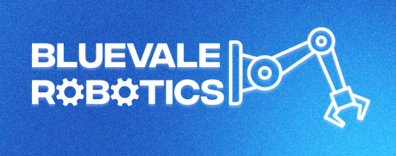

# BCI-Robotics-Mechmania

  

  <strong> A BCI Robotics Repo for MechMania 2026 </strong>

  <a href="#Sharpshooter">Sharpeshooter</a> •
  <a href="#Tree Planting">Tree Planting</a> •
  <a href="#development">Development</a> •
  <a href="#Team">Authors / Team</a> •
  <a href="#License">License</a>

# Sharpshooter
  - WIP
  - <a href="/Sharpshooter">/Sharpshooter</a> 
# Tree Planting
  - WIP
  - <a href="/Tree-Planting">/Tree Planting</a>

## Development

- v0 - unfinished
  
# Team
- [Ashton Grant](https://github.com/TulipTult)
- [Kevin Han](https://github.com/kevdakat123)
- Goldygo Yany (him)
  
## License

This project is licensed under the MIT License - see the LICENSE file for details.

## Quick Links

[Item Catalog](https://docs.google.com/spreadsheets/d/1fYpj9MYEXPuqCvE3B24-uK8T4NWwFtT0agY93pXbgK8/edit?usp=sharing)
